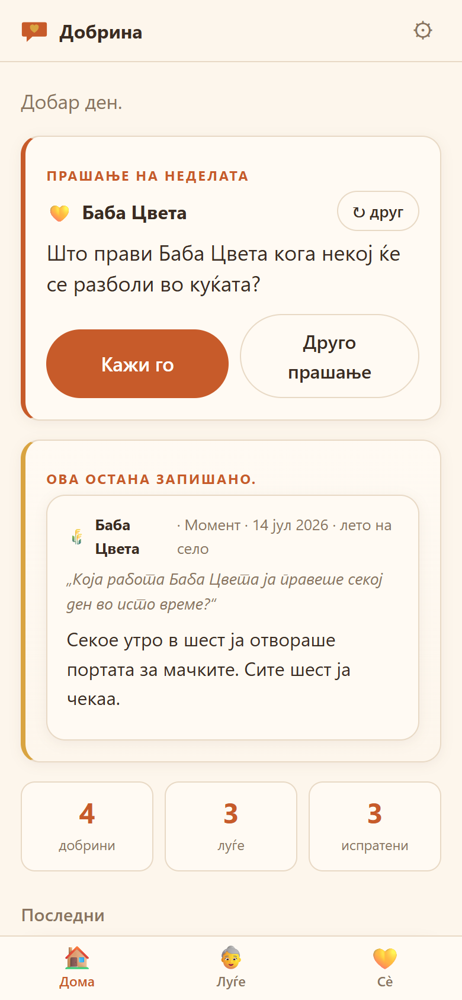
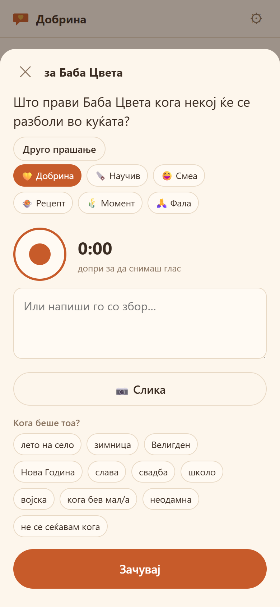
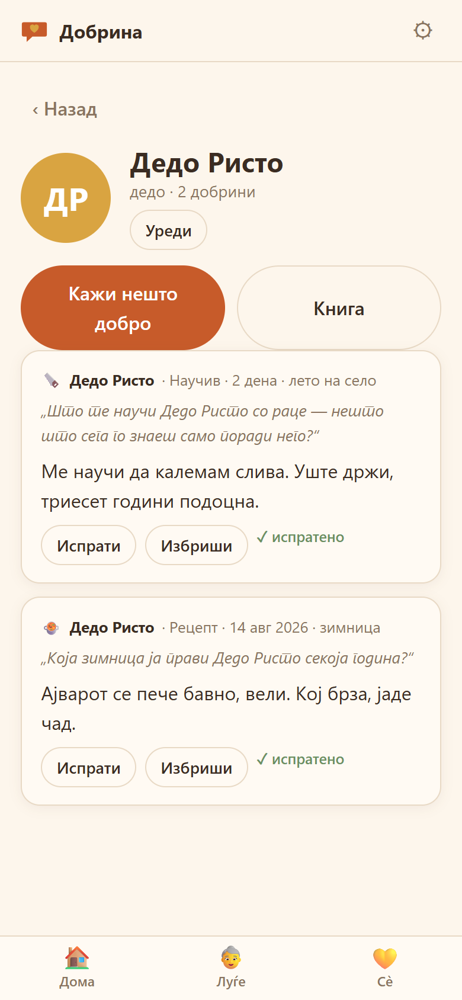

# Добрина

**Кажи го денес, не еден ден.**

Еднаш неделно, едно прашање за еден човек. Триесет секунди глас. И — ова е целата поента — **го испраќаш веднаш, додека има кому**.

Архивата се составува сама, како нуспојава од тоа што некому си го направил денот.

### [⬇ Преземи за Android](https://github.com/Ljupcho1982/dobrina/releases/latest/download/dobrina.apk) · [Страница за преземање](https://ljupcho1982.github.io/dobrina/)

Бесплатно, офлајн, без сметка, без сервер. APK-от е debug-потпишан и не оди преку Google Play — Android ќе побара дозвола за инсталација од непознат извор.

<p>
  
  
  
</p>

---

## Зошто вака, а не како другите

Апликациите за семејни спомени се делат на три вида, и сите три ја пропуштаат работата:

| Што постои | Што прави | Што му фали |
|---|---|---|
| StoryWorth, Remento | старецот пишува домашна задача, семејството добива книга | работата ја врши оној на кого му е најтешко, а наградата ја добива друг |
| Kudoboard, Tribute | една табла, за еден повод | еднократно, и врзано за еден датум — роденден, пензионирање, збогување |
| мемориjaли | чуваат што останало по некого | не создаваат ништо ново, а датумите болат |

Добрина ја врти насоката: **внукот ја врши работата, дедото ја добива наградата.** Книгата се создава сама, и кога еден ден ќе стане спомен — секој ред во неа веќе бил кажан в лице.

Истражувањето зад ова:

- **Писмото на благодарност** е најсилната позната интервенција во позитивната психологија, но ефектот бледее за околу шест месеци ако не се повтори. Значи бара ритам — токму она за што служи апликација.
- **„Три добри работи“** дневно кревало среќа мерливо до шест месеци по едненеделна вежба.
- **Реминисценција со стари слики и гласови** мерливо ја крева расположбата и когницијата кај постари луѓе (REMPOS).
- **„Емоционална прокрастинација“** — јапонското *seizensō* (обред на збогување додека си жив) постои затоа што чекаме уште еден празник, уште една година.

## Шест вида записи

| | | |
|---|---|---|
| 💛 **Добрина** | нешто добро што го направил | 18 прашања |
| 🪚 **Научив** | вештина, реченица, занает што преминал на тебе | 16 |
| 😄 **Смеа** | „сними ја баба како се смее“ — снимката што најмногу ќе ја сакаш | 12 |
| 🍲 **Рецепт** | тројанскиот коњ: никој не сака „да биде снимен“, но сите даваат да ги снимиш како готват | 11 |
| 🌾 **Момент** | една слика од едно време | 12 |
| 🙏 **Фала** | право до него, без околу | 10 |

Вкупно **79 прашања**, сите со името внатре.

## Одлуки што ја држат топла

- **Сезони, не датуми.** „лето на село“, „зимница“, „Велигден“ — луѓето така паметат, а не со бирач на ден.
- **Слава наместо роденден** како главен повод. Тој ден и онака сите се во иста соба и раскажуваат за домаќинот. 18 слави се внатре, по граѓански календар.
- **Изненадување.** Стара добрина исплива во обичен вторник — не на годишнина, не на роденден. Таму е кревањето.
- **Никаква црнина.** Топла палета, кујна во шест попладне. Никаде не стои „починал“, никаде датум на смрт. Личноста има само прекинувач „може да прими порака“ — кога е исклучен, „Испрати“ станува „Сподели со семејството“, и ништо повеќе не се менува.
- **Бабата нема да инсталира ништо.** Затоа испраќањето оди преку Web Share — Viber, WhatsApp, што и да е. Апликацијата ја прави снимката, Viber ја носи. Само внукот има инсталирано.

## Вечен извоз

Целото ветување е „ова ќе нè надживее“, а телефон што паѓа во вода е најлошото место за тоа.

Затоа копчето **Зачувај ја книгата** снима **една единствена HTML-датотека** со сè внатре — текст, слики и гласови како `data:` URI. Се отвора во кој било прелистувач, без интернет, без оваа апликација, и за триесет години. Има и `.json` резерва што се враќа назад во апликацијата.

## Стек

Ванила JS, без ниту една надворешна библиотека. Текстот во `localStorage`, гласот и сликите во IndexedDB. PWA + Capacitor за Android.

```
www/
  index.html   екрани и листови
  app.js       состојба, снимач, извоз
  data.js      79 прашања, врски, сезони, слави
  styles.css   топла палета, светла и темна
  sw.js        офлајн кеш
tools/
  selftest.js  проверки на содржината и на кодот
```

## Работа

```bash
npm run serve
```

```bash
npm test
```

```bash
npm run apk
```

`build-apk.ps1` го печати бројот на верзијата во името на кешот, ја додава `RECORD_AUDIO` дозволата во `AndroidManifest.xml` (без неа `getUserMedia` молчи и апликацијата изгледа расипана), и гради debug APK.

## Состојба

Работи: онбординг, прашање на неделата со ротација на луѓе и видови, снимање глас, слика со намалување, сезони, ѕид по личност, филтер, изненадување, роденден и слава што доаѓаат, книга, вечен извоз со вградени медиуми, резерва и враќање, неделен потсетник преку `@capacitor/local-notifications` (на веб тивко се прескокнува).

Проверено во прелистувач: целата низа од онбординг до извоз, враќање по оштетена IndexedDB, светла и темна тема, без хоризонтално лизгање на 375px.

Не е направено: споделен ѕид меѓу повеќе телефони (v1 оди преку извоз/увоз, не преку сервер), други јазици освен македонски, потпишан release APK.

## Никогаш

Нема и нема да има синтетички глас на човек што го нема. Постојат апликации што го прават тоа. Само вистинскиот глас, само вистинските зборови.

MIT.
